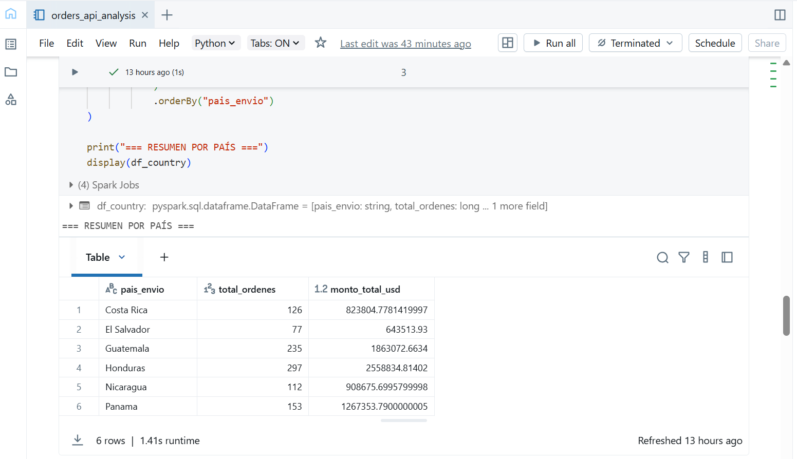
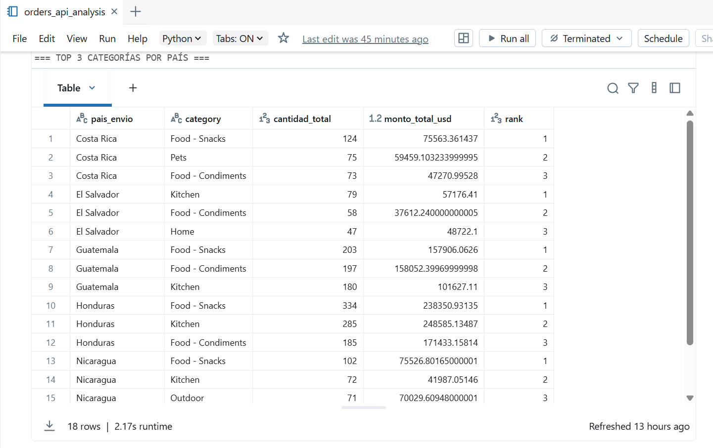

# Data Ingestion – Technical Challenge

Este repositorio contiene la solución completa al caso técnico propuesto por la empresa **Data Ingestion**.

La prueba evalúa tres capacidades:

1. SQL para análisis de un modelo relacional.
2. Python para ingesta y análisis de un API.
3. Diseño de arquitectura moderna en Azure bajo un enfoque Medallion + Data Vault.

---

## 📌 Estructura del Repositorio

```
data-ingestion-technical-challenge/
│
├── sql/
│   └── top10_products.sql
│
├── api_orders/
│   └── orders_api_analysis.ipynb
│
├── cloud_architecture/
│   ├── modernization_diagram.drawio
│   └── modernization_proposal.md
│
└── assets/
    ├── relational_model.jpg
    └── challenge_description.pdf
```

---

## ✔ 1. Consulta SQL – Top 10 productos más vendidos

Consulta disponible en `sql/top10_products.sql`.

---

## ✔ 2. Notebook PySpark – Consumo y análisis del API de órdenes

Script disponible en `api_orders/orders_api_analysis.ipynb`.

---

## ✔ 3. Propuesta de modernización a Nube – Azure

Explicación completa en `cloud_architecture/modernization_proposal.md`.

Diagrama editable: `cloud_architecture/modernization_diagram.drawio`.

---

## 🧪 Ejecución del notebook PySpark


1) Creacion del cluster en el workspace databricks


2) Carga del notebook y ejecución





---

## 👤 Autor
Italo Contreras - Senior Data Engineer
